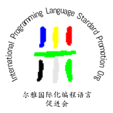

尔雅国际化编程语言促进会 I.org
==================================

尔雅国际化编程语言促进会：一个致力于推动编程语言国际化的组织。

i-org = International Programming Language Stardard Promotion Org

### 标志说明： ###

“六洲一沟通”，“列”的甲骨文，标志颜色定义，参考奥林匹克五环色，另外，南极洲也是编程语言需要使用的地方，所以比奥运多了一色：

+ 天蓝色代表欧洲，黄色代表亚洲，红色代表美洲
+ 赤道：代表沟通
+ 黑色代表非洲，草绿色代表澳洲，南极洲银灰

